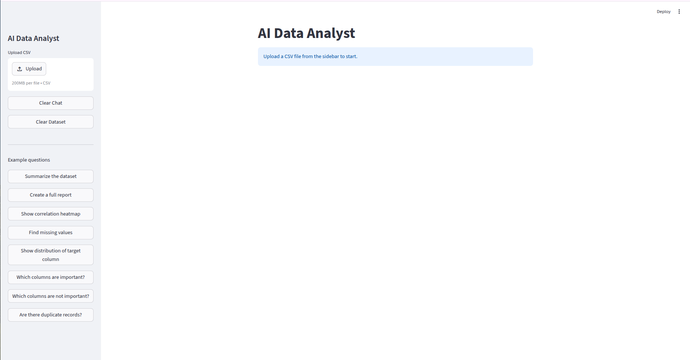
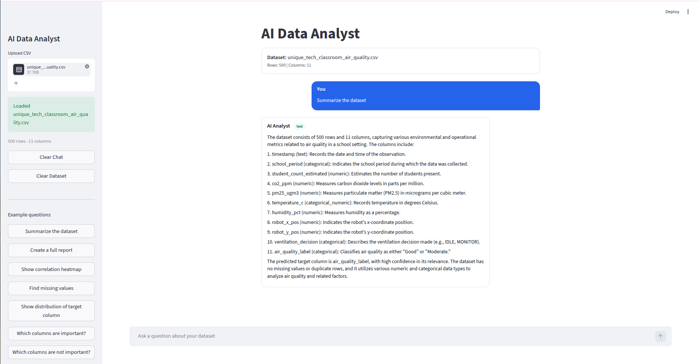
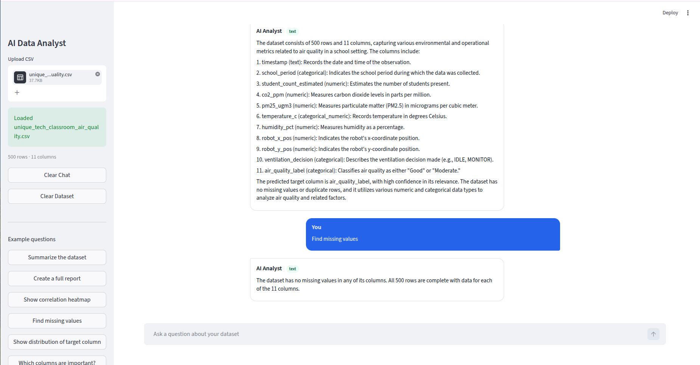
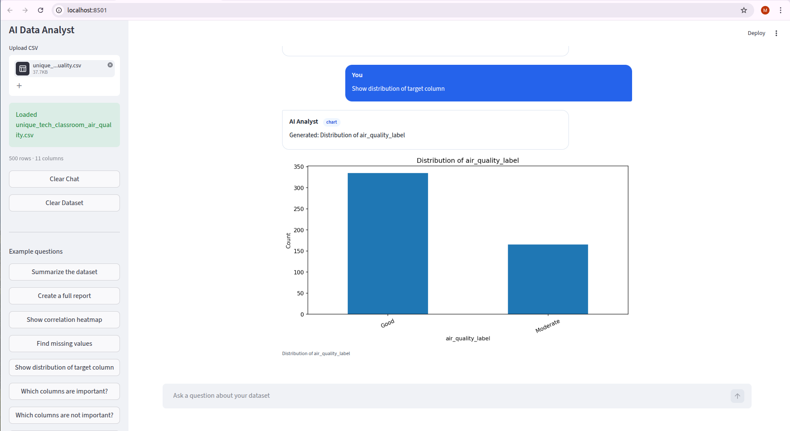
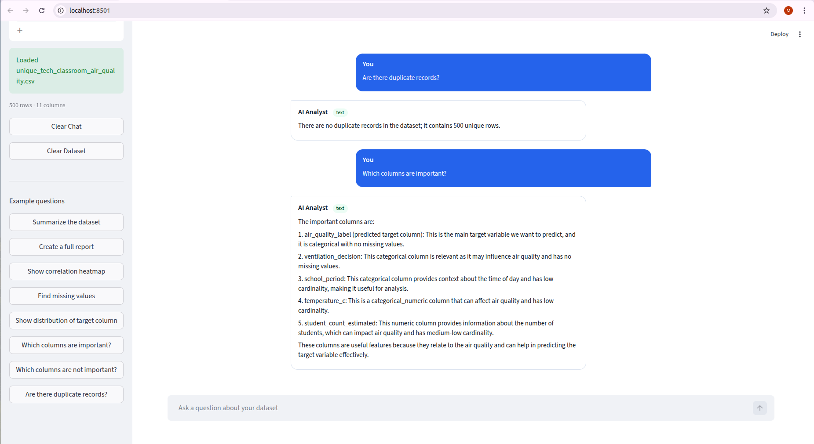
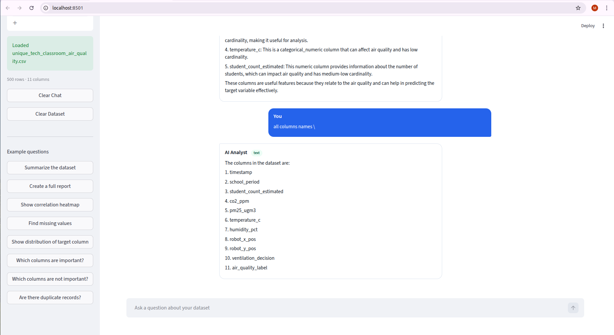
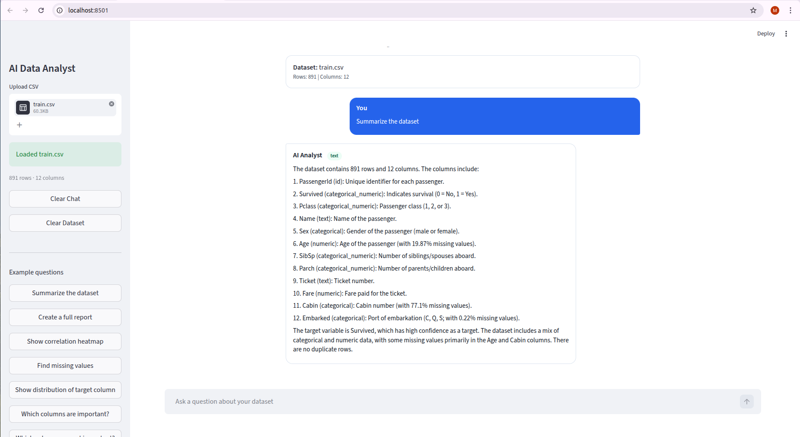
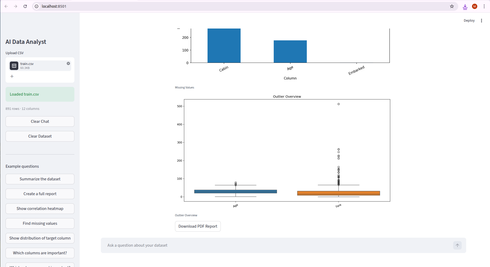
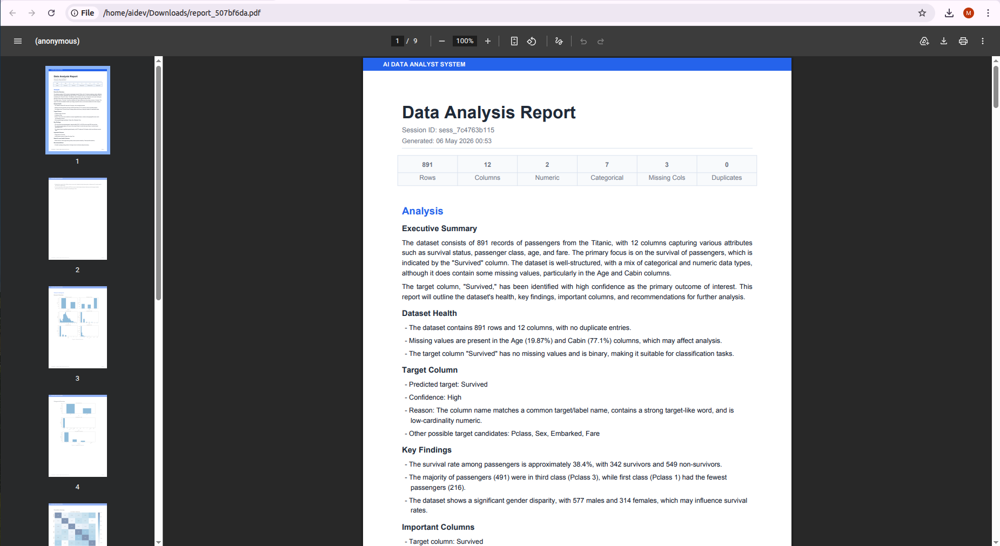
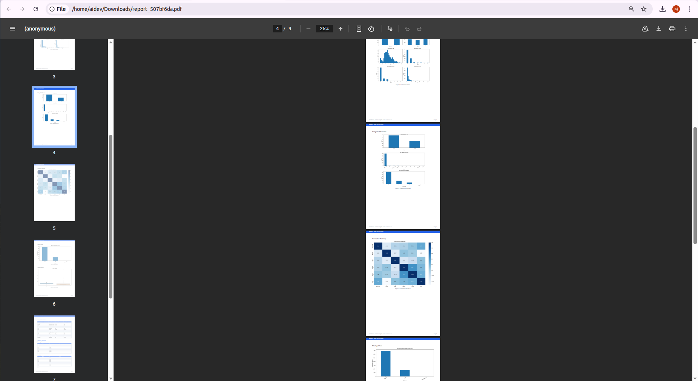

#  AI Data Analyst — FastAPI + Streamlit

An AI-powered data analysis system that allows users to upload CSV datasets, ask natural language questions, generate charts, get dataset insights, detect possible target columns, and export professional PDF reports.

This project combines **FastAPI**, **Streamlit**, **LangGraph**, **OpenAI**, **Pandas**, and **Matplotlib/Seaborn** to create an interactive AI Data Analyst assistant.

---

##  Project Overview

AI Data Analyst is designed to help users understand datasets without writing code.

Users can:

- Upload a CSV dataset
- Ask questions in simple English
- Get AI-generated analysis
- Generate charts automatically
- Detect missing values and duplicate rows
- Identify possible target columns
- View useful and weak columns
- Generate downloadable PDF reports

The system works like a smart data analyst that reads the dataset profile and gives clear, practical answers.

---


##  Project Screenshots

Below are the working screenshots of the **AI Data Analyst** application.

---

### 1. Initial Upload Screen


---

### 2. Dataset Uploaded Successfully And  AI Dataset Summary 


---

### 3. Missing Values Analysis


---

### 4. Target Column Distribution Chart


---

### 5. Important Columns Analysis


---

### 6. . All Dataset Columns


---

### 7. Titanic dataset uploaded and summarized


---

### 8. Download Generated PDF Report


---

### 9.Generated PDF Report for Titanic Dataset


---

### 10.Generated PDF Report for Titanic Dataset



##  Key Features

###  CSV Dataset Upload
- Upload CSV files through the Streamlit frontend
- Backend reads the dataset using Pandas
- Column names are cleaned automatically
- A unique session ID and dataset ID are created

###  AI-Powered Question Answering
- Ask questions like:
  - “Give me a summary of this dataset”
  - “What is the target column?”
  - “Which columns are important?”
  - “Find missing values”
  - “Generate a full report”

###  Smart Intent Detection
The system classifies user questions into:

- `text` — for explanation and analysis
- `chart` — for visualizations
- `both` — for analysis with charts

###  Automatic Chart Generation
Supports multiple chart types:

- Bar charts
- Pie charts
- Histograms
- Scatter plots
- Correlation heatmaps
- Missing value charts
- Numeric column overview
- Categorical column overview

###  Target Column Detection
The backend analyzes column names, data types, value patterns, uniqueness, and user corrections to predict the possible target column.

Example target columns:

- `Survived`
- `Loan_Status`
- `Price`
- `Churn`
- `Diagnosis`
- `Fraud`
- `Status`

###  PDF Report Generation
Generate professional PDF reports including:

- Executive summary
- Dataset health
- Target column
- Key findings
- Important columns
- Weak columns
- Recommendations
- Charts and captions

###  Chat History Support
The assistant remembers recent conversation context within the same session.

###  Streamlit Frontend
A clean and simple chat-style interface where users can:

- Upload a dataset
- Ask questions
- View AI responses
- See charts
- Download PDF reports

---

##  Tech Stack

### Backend
- FastAPI
- LangGraph
- OpenAI API
- Pandas
- NumPy
- Matplotlib
- Seaborn
- ReportLab
- Python Dotenv

### Frontend
- Streamlit
- Requests
- Custom HTML/CSS styling

---

##  System Workflow

```text
User Uploads CSV
        ↓
FastAPI reads dataset
        ↓
Dataset stored in session memory
        ↓
User asks a question
        ↓
LangGraph workflow starts
        ↓
Data Agent creates dataset summary
        ↓
Intent Agent detects request type
        ↓
Text Agent / Visualization Agent runs
        ↓
Optional PDF Report Agent runs
        ↓
Response returned to Streamlit UI
```

---

##  AI Agent Architecture

The backend is divided into multiple agents:

### 1. Data Agent
Responsible for:

- Cleaning dataframe columns
- Inferring column roles
- Detecting numeric, categorical, text, ID, and datetime columns
- Finding missing values
- Finding duplicate rows
- Creating dataset summary
- Predicting target column

### 2. Intent Agent
Responsible for detecting whether the user wants:

- Text explanation
- Chart generation
- Both analysis and charts

### 3. Text Agent
Responsible for:

- Sending compact dataset profile to the LLM
- Generating simple and useful analysis
- Answering questions using only dataset summary
- Avoiding fake or invented values

### 4. Visualization Agent
Responsible for:

- Understanding chart requests
- Selecting correct columns
- Generating visual charts
- Saving chart images

### 5. Report Agent
Responsible for:

- Creating professional PDF reports
- Adding dataset summary
- Adding insights
- Adding tables
- Adding charts
- Exporting report as downloadable PDF

---

##  Project Structure

```text
ai_data_analyst_fastapi_project/
│
├── backend/
│   │
│   ├── main.py
│   ├── requirements.txt
│   ├── .env
│   │
│   ├── models/
│   │   └── schemas.py
│   │
│   ├── modules/
│   │   ├── state.py
│   │   ├── workflow.py
│   │   ├── data_agent.py
│   │   ├── intent_agent.py
│   │   ├── text_agent.py
│   │   ├── viz_agent.py
│   │   ├── report_agent.py
│   │   ├── llm_client.py
│   │   └── settings.py
│   │
│   ├── routes/
│   │   ├── upload.py
│   │   ├── ask.py
│   │   └── files.py
│   │
│   ├── services/
│   │   └── store.py
│   │
│   ├── charts/
│   │   └── generated chart images
│   │
│   └── reports/
│       └── generated PDF reports
│
└── frontend/
    └── app.py
```


---


##  Why This Project Is Useful

This project helps users analyze data faster without writing Python code.

It is useful for:

- Students
- Data analysts
- Business users
- Researchers
- ML beginners
- Dashboard creators
- Companies that need quick dataset insights

---

##  Author

Developed by **Muhammad Shoaib**

```text
AI Data Analyst System
FastAPI + Streamlit + LangGraph + OpenAI
```

---

##  License

This project is for learning, research, and portfolio use.

You can modify and extend it based on your needs.
